

# 🎓 Student Study Plans · خطط دراسية للطلاب

**By students, for students — plan your degree, track your progress.**
**من الطلاب، إلى الطلاب — خطّط لدرجتك وتابع تقدّمك.**

An unofficial, offline-first study-planning app for university students.
Pick your university → college → study plan, then track every course,
prerequisite, and your GPA — in English or Arabic, on any phone.

### ▶️ **[Open the app](https://jo0dile.github.io/MyMenuPack/plan.html)**

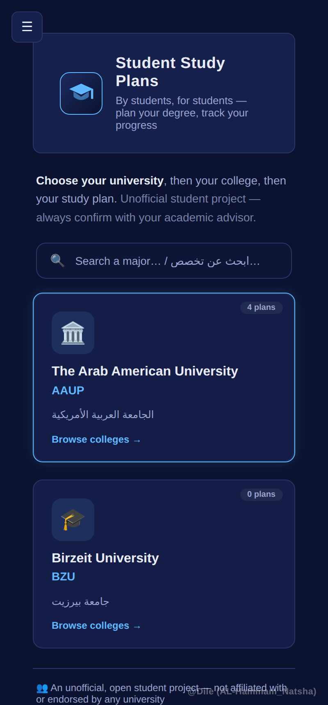

---

## ✨ What it does

- **University → College → Plan** — browse Arab American University's plans
  (AI & Robotics, AI & Cybersecurity, AI & Medical Sciences, Computer
  Science), with room to add more universities.
- **Track your progress** — check off completed courses; your credit-hour
  progress and GPA update automatically.
- **See prerequisites at a glance** — every course shows what it needs and
  what it unlocks; press and hold a course to trace its chain.
- **Bilingual** — the whole study plan flips between English and Arabic
  (with full right-to-left layout).
- **Works offline** — install it once and it opens instantly with no
  internet, like a real app.
- **Achievements, a printable advising sheet, difficulty ratings,
  interactive tutorials**, and more.

> ⚠️ **Unofficial student project — not affiliated with or endorsed by any
> university. Always confirm your plan with your academic advisor.**
> مشروع طلابي غير رسمي — تأكد دائمًا من خطتك مع مرشدك الأكاديمي.

---

## 📖 How to use it

### 1. Choose your university, college, then plan
Start on the home screen, tap a university, then its college, then the
study plan you're following.

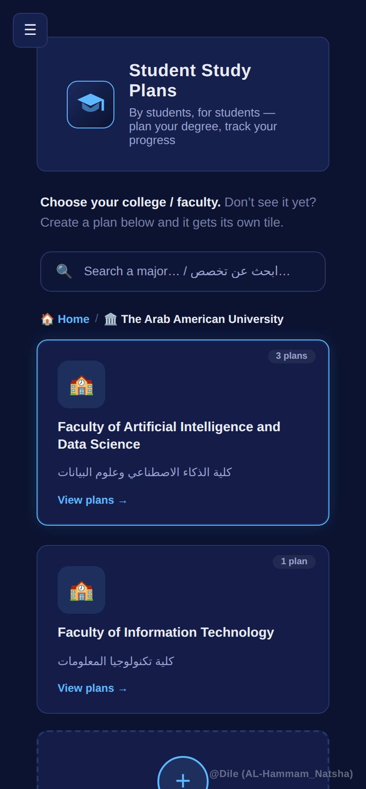
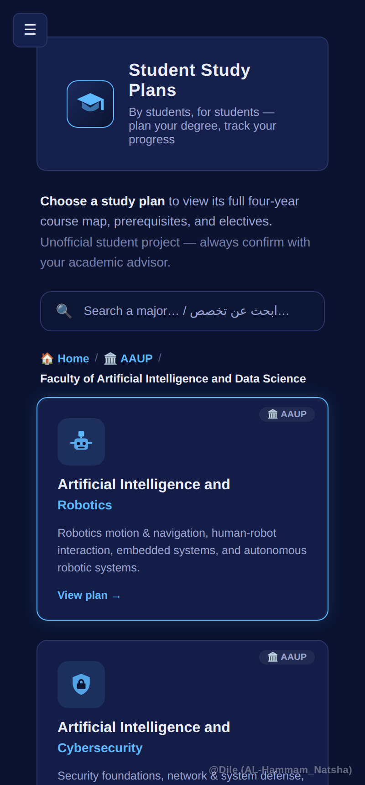

### 2. Your dashboard
Once you pick a plan you land on a dashboard: overall progress, GPA, how
many achievements you've unlocked, and what you can take next.

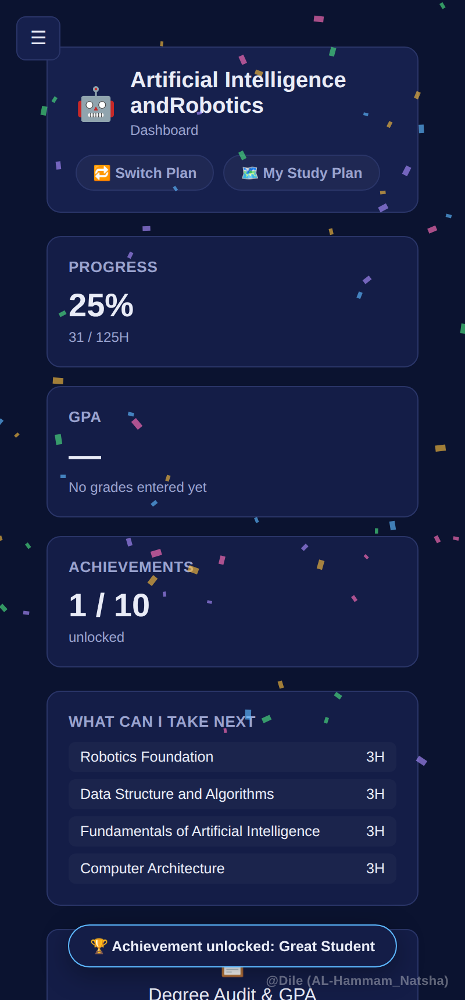

### 3. The study plan map
The full four-year map. Tap the circle on any course to mark it complete —
completed courses turn green, and the ones you're now eligible for light up
as **Available**. A course and its lab are grouped in a dashed box.

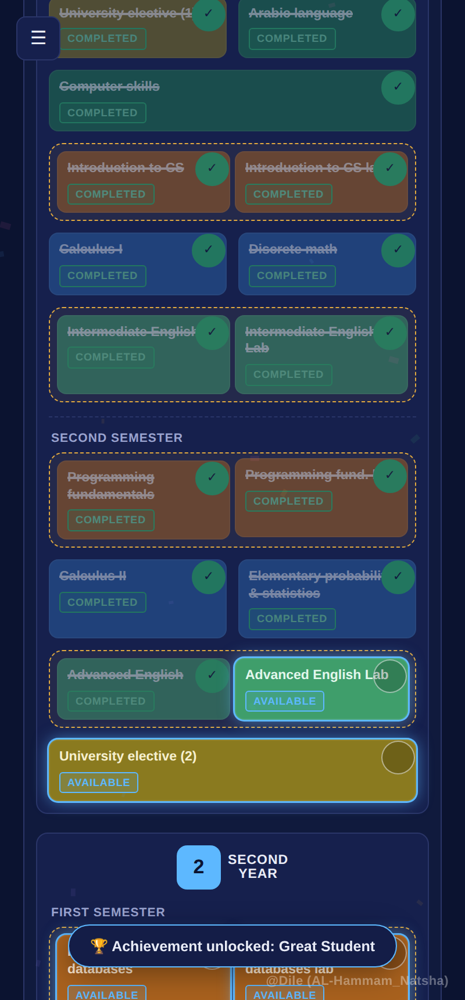

### 4. Course details & prerequisites
Tap any course to see its number, credit hours, what it needs, and what it
unlocks. On a phone, **press and hold** a course to trace its prerequisite
lines; on a computer, just hover it.

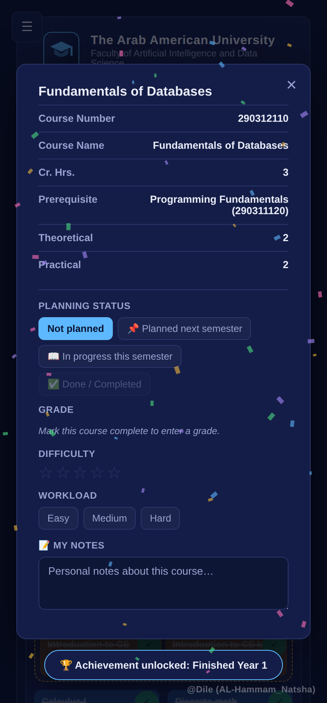

### 5. Achievements
Small goals that unlock as you go — each locked one shows exactly how much
is left. Unlock one and you get a shareable card.

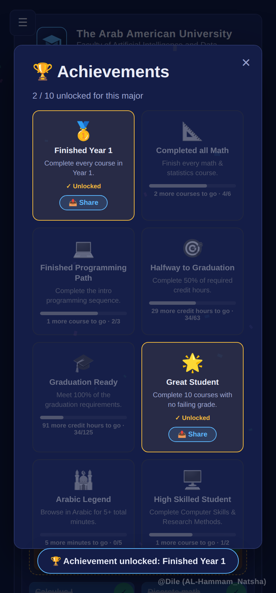

### 6. Overview & print
A compact one-page overview of your whole plan — perfect to print or save
as a PDF and bring to an advising meeting.

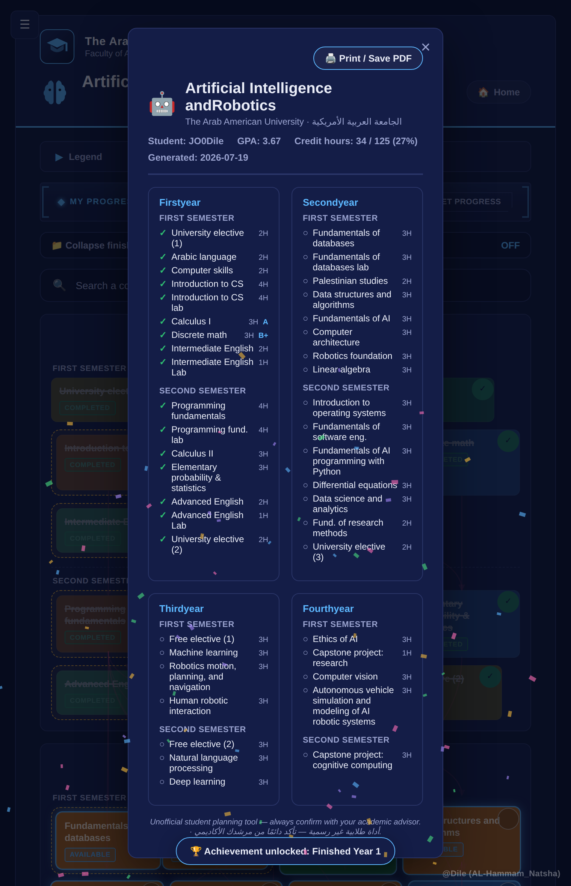

---

## 📲 Install it as an app on your phone

You don't need an app store. Open the app in your browser, then:

1. Open the browser menu and choose **Install and create shortcut**.
2. Tap **Install**.
3. It now lives on your home screen and opens like a normal app — even
   offline.

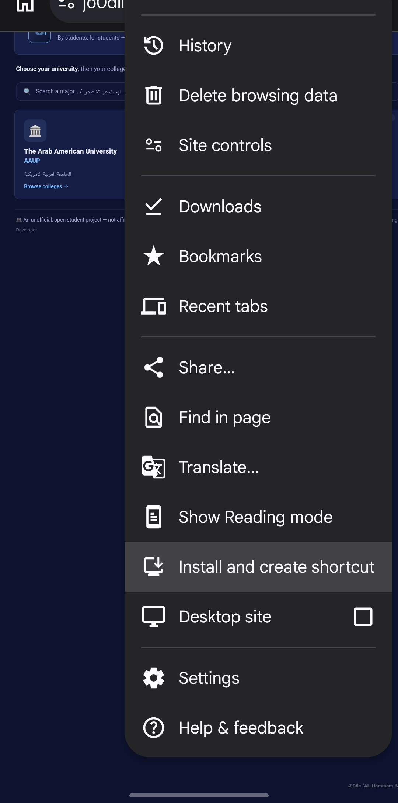
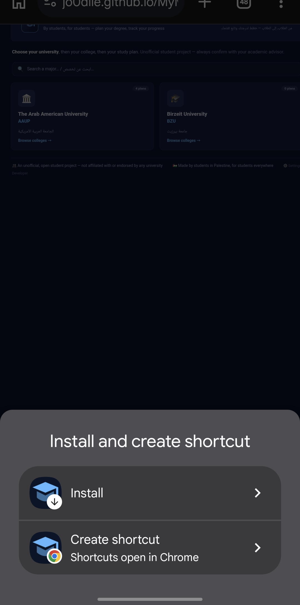
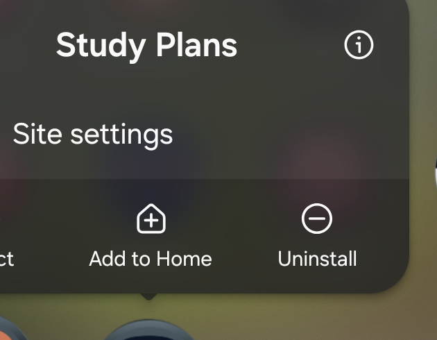

---

## 🔒 Your data stays yours

Everything — your progress, GPA, custom plans, notes — is saved **only in
your own browser** (`localStorage`). Nothing is uploaded, no account is
needed, and the app never transmits your data anywhere. Use **Export
Progress** in Settings to back it up or move it to another device.

---

## 🛠️ For the curious (tech)

- A single self-contained HTML file (`app/plan.html`) — no build step, no
  framework, no dependencies.
- A Progressive Web App: a service worker (`app/sw.js`) caches it for
  offline use and quietly picks up updates when online.
- Hosted free on GitHub Pages; deployed automatically from the `app/`
  folder on every push.

---

## 📄 License

Copyright © 2026 **JO0Dile**. All Rights Reserved. See [LICENSE](LICENSE).
